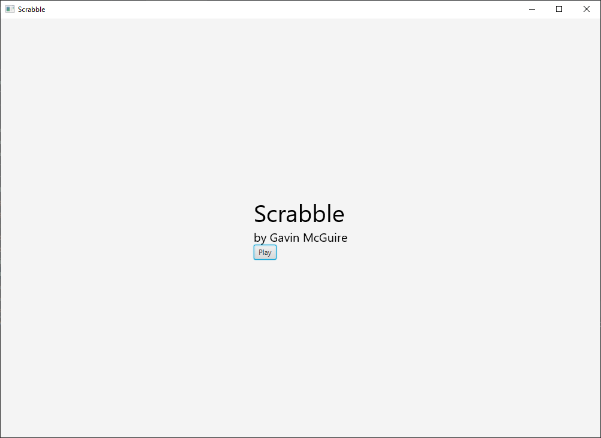
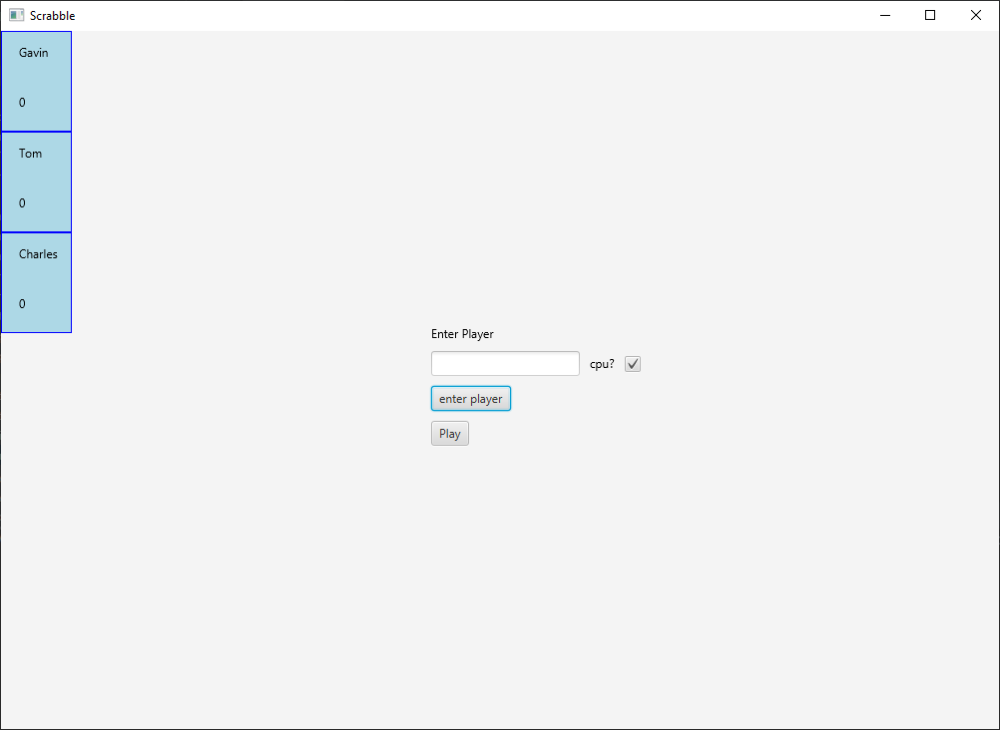
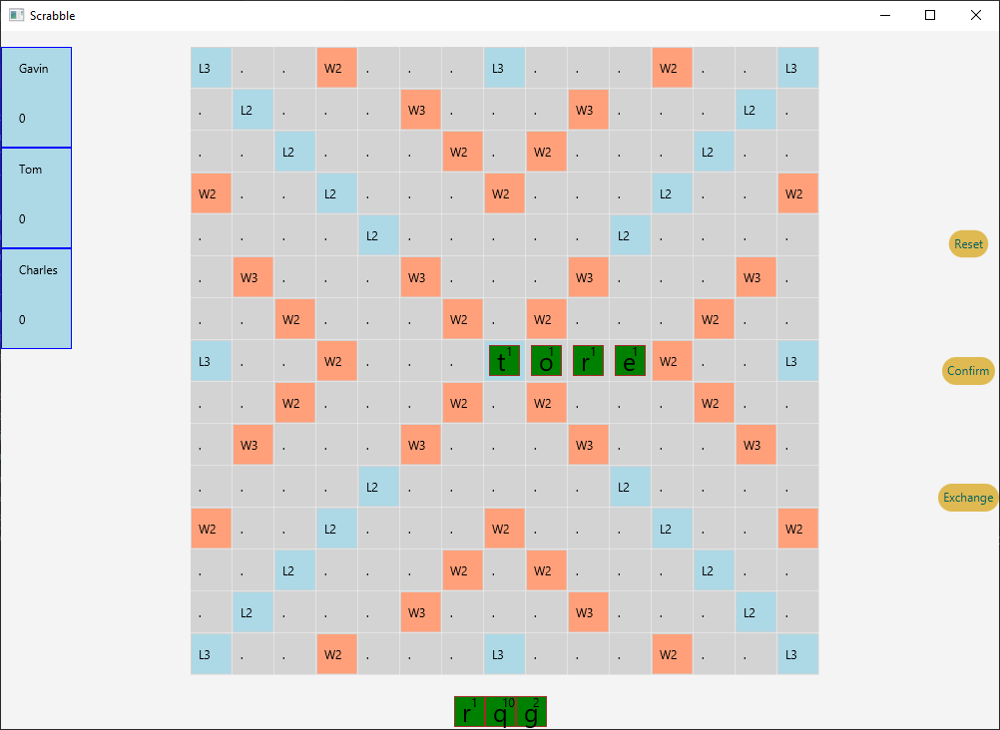
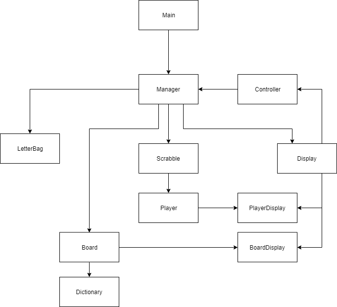

# Scrabble
by Gavin McGuire

Scrabble is a game played with at least two players.
- Each player places up to 7 letters on the board to make a word. 
- Then adds the points including the boards score multipliers at the end of each turn.
- It is played until all the letters are depleted.

## How to run program

* out > artifacts > Scrabble_jar

then right-click and choose "run Scrabble jar" to run the program

## Images

## Development

## Known Issues

* score does not add up correctly
* computer player does not play

